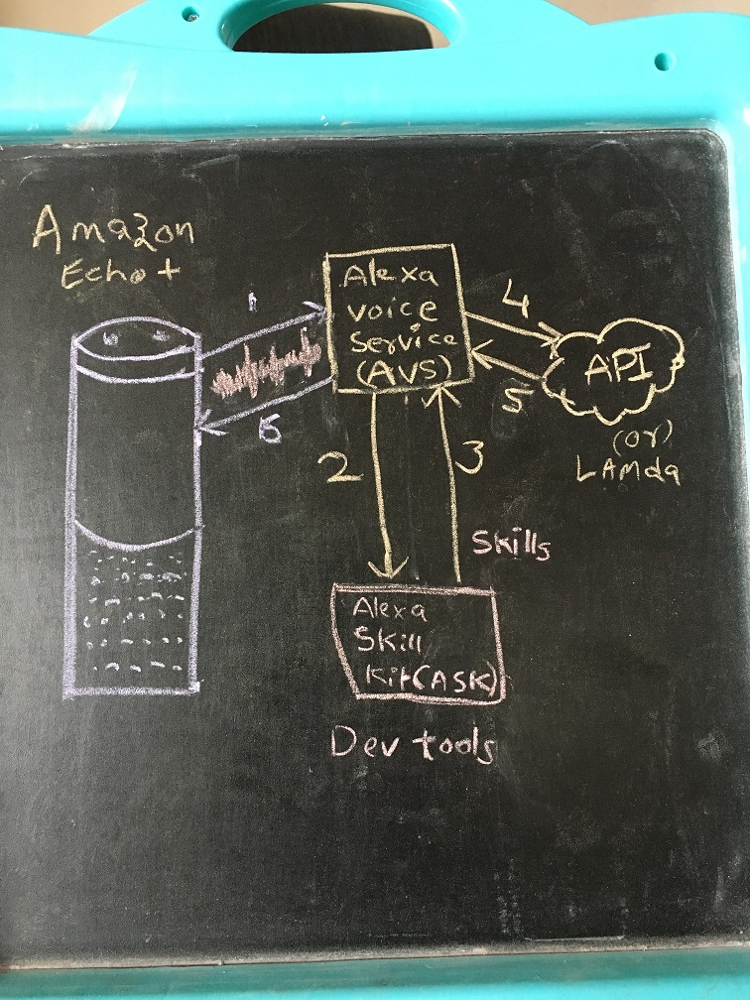

# Yashu-Alexa-Skill

An Alexa skill to use it as a personal assistent.

## Request Flow
Here is the Alexa Request Flow for reference.

  

### Steps

1. Receive and send a voice request from Amazon echo or echo plus
2. Amazon Voice Service (AVS) receve the voice request and convert to text message
3. Send the Text message to identify the appropriate skill Alexa Skills Kit (ASK). This is done based on the Developer Tools to identify/process the Utterances, Intents and Slots
4. Construct the a request object based on the appropriate/identified Utterances, Intents and Slots 
5. Call the configured endpoint based on the constructed Request object
6. Process the request and send the response to AVS in SSML
7. Process the response and send to Amazon Echo in voice format

## Deploying locally

Make sure you have [Node.js](http://nodejs.org/) and the [Heroku Toolbelt](https://toolbelt.heroku.com/) installed.

```sh
git clone https://github.com/puttareddy/yashu-alexa-skill.git # or clone your own fork
cd yashu-alexa-skill
npm install
npm start
```

Your app should now be running on *[http://localhost:8080](http://localhost:8080)*.

For testing purposes, you can use either [ngrok](https://ngrok.com/download) or [localtunnel](https://github.com/alexa-js/alexa-home-server) before you deploy the app to any cloud hosted environments

### Testing it

You can access a test page to verify if the basic setup is working fine: *[http://localhost:8080/test](http://localhost:8080/test)*.

## Deploying to Heroku

```sh
heroku create
git push heroku master
heroku open
```

Alternatively, you can deploy your own copy of the app using this button:

[](https://heroku.com/deploy?template=https://github.com/puttareddy/yashu-alexa-skill)

Your app should now be running on *https://`<app-name>`.herokuapp.com*, where `<app-name>` is the heroku app name.

### Testing it

You can access a test page to verify if the basic setup is working fine: *https://`<app-name>`.herokuapp.com/test*.

### Create a New Skill

* Sign into AWS Developer Console, [https://developer.amazon.com](https://developer.amazon.com).
* Choose Alexa, Alexa Skill Kit
* Add a New Skill
* Fill Out Forms with INTENTS and UTTERANCES values from the above deployed endpoint. Invoke and copy these values from the ```/test``` endpoint from the above deployed application.
* Choose `HTTPs` in _Service Endpoint Type_ in the Alexa app configuration on [developer.amazon.com](https://developer.amazon.com) and point to deployed app at `https://<app-name>.herokuapp.com/test`. Application name would change based on where it is deployed.

OR 
* Just specify the Lambda ARM, if you deploy it as a Lambda function

The skill is now available in [http://alexa.amazon.com](http://alexa.amazon.com).

#### Try It

* Alexa, ask yashu to tell about puttareddy.
* Alexa, ask yashu who is Murali.
* Alexa, ask yashu my age is 30.
* Alexa, ask yashu my name is puttareddy and I am 30 years old. 


### References

This Alexa Skill is built by using the [alexa-app](https://github.com/alexa-js/alexa-app) module with Express.
